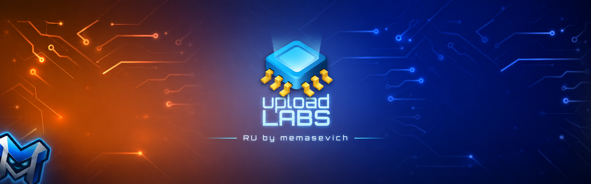

# Upload Labs by memasevich

<div align="center">
  
</div>

Полная русская локализация **Upload Labs** с переводом интерфейса, обучения, узлов, ресурсов, исследований, улучшений, перков, достижений и справки.

## Установка в Steam

1. Скачайте файл [`memasevich-RussianLocalization.zip`](memasevich-RussianLocalization.zip).
2. В Steam откройте: **Библиотека → Upload Labs → Управление → Просмотреть локальные файлы**.
3. В открывшейся папке найдите каталог `mods`. Если его нет — создайте его вручную.
4. Скопируйте ZIP-файл в папку `mods`. Распаковывать архив не нужно.
5. Запустите игру и выберите русский язык в настройках.

Если русский язык не появился в меню, добавьте в параметры запуска игры Steam:

```text
--language ru
```

Параметры запуска находятся здесь: **Steam → Upload Labs → Свойства → Общие → Параметры запуска**.

## Что переведено

- интерфейс и меню;
- обучение и подсказки;
- узлы и производственные машины;
- ресурсы и описания механик;
- исследования, улучшения и перки;
- достижения, статистика и справочные материалы.

Перевод рассчитан на Upload Labs **2.2.12** и ModLoader **7.0.1**. Исполняемый файл игры не изменяется.

## Обратная связь

Если найдёте неточность или неудачную формулировку, создайте Issue с названием строки и контекстом, где она отображается.

<div align="center">
  <br>
  
  <br>
  <sub>Russian localization by memasevich</sub>
</div>
